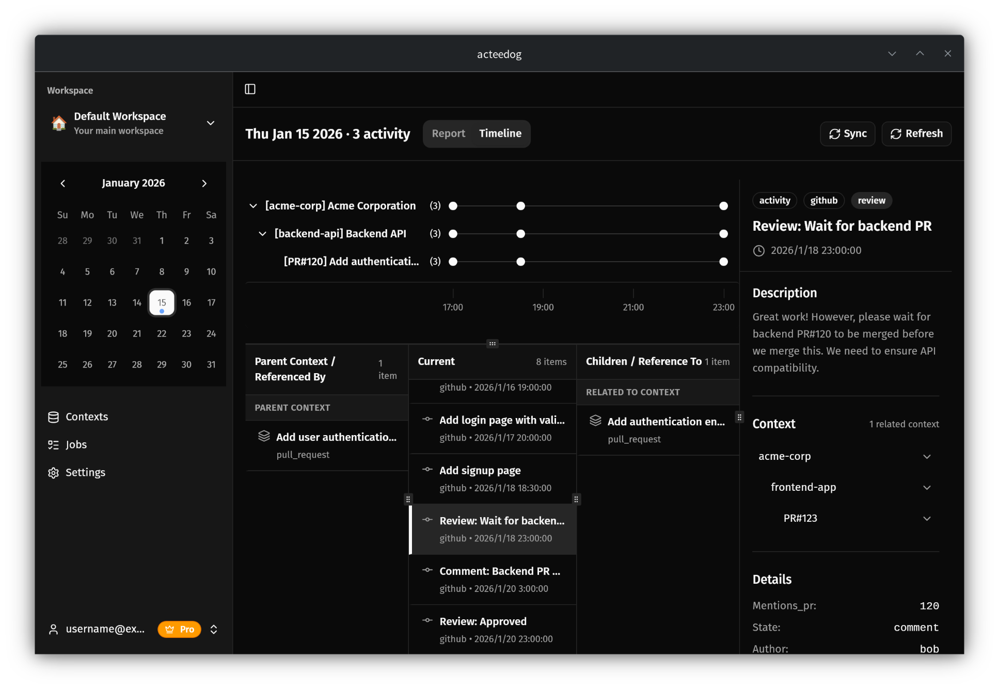

<h1 align="center"><a href="https://acteedog.com">Acteedog</a></h1>

<p align="center"><em>Your work, organizes itself.</em></p>

<p align="center">
  <strong>AI-Ready Activity Layer</strong> — Automatically collects and structures activities scattered across GitHub, Slack, Jira, and more, providing context that AI agents can use directly.
</p>

<p align="center">
  <code>GitHub</code> · <code>Slack</code> · <code>Jira</code> · and more
</p>



---

## Overview

Work logs are scattered across tools — PRs, issues, commits, and messages each live in isolation, making the overall flow invisible. AI alone can't reconstruct your workflow without structured, cross-tool context. Acteedog collects, links, and structures everything automatically, storing it locally so your work history is always ready for you and your AI agents to use.

## Key Features

- **Automatic structuring & linking** — Links PRs, issues, commits, and messages across systems. Set it up once; activity is collected automatically.
- **AI-ready via MCP** — Structured data is available directly to AI via the MCP server. Generate reports with your own API key. Supports customizable prompts.
- **Full control, your way** — Freely customize prompts and output formats. Works with any LLM.
- **Local-first & secure** — All activity data is stored on your machine and never sent to our servers.

## Download

Download the latest version from [Releases](https://github.com/acteedog/acteedog-release/releases/latest).

| Platform | Architecture |
|----------|-------------|
| macOS    | Apple Silicon (aarch64) |
| Windows  | x86_64 |
| Linux    | x86_64 |

## Auto-Update

If you already have Acteedog installed:

1. Open the app
2. Go to **Settings** > **About**
3. Click **"Check for Updates"**
4. Restart the app

## AI Agent Skills

Acteedog ships agent skills that work with [Claude Code](https://claude.ai/code) and other AI coding assistants.

### Installation

```bash
npx skills add acteedog/acteedog-release
```

### Available Skills

| Skill | Description |
|-------|-------------|
| `daily-report-en` | Fetches your activities from the Acteedog MCP server and generates a structured daily report in English |
| `daily-report-ja` | Fetches your activities from the Acteedog MCP server and generates a structured daily report in Japanese |

### Requirements

- [Acteedog](https://acteedog.com) installed and running
- Acteedog MCP server configured in your AI assistant
  - [English setup guide](https://acteedog.com/en/docs/ai-integration/mcp-server)
  - [日本語セットアップガイド](https://acteedog.com/ja/docs/ai-integration/mcp-server)

## Documentation

- English: https://acteedog.com/en/docs
- 日本語: https://acteedog.com/ja/docs

## Bug Reports & Feature Requests

- **App-related issues** (bugs, feature requests, UI, performance, etc.):  
  👉 https://github.com/acteedog/acteedog-release/issues

- **Connector-related issues** (existing connectors, new connector requests, schema, etc.):  
  👉 https://github.com/acteedog/acteedog-connectors/issues

## License

Copyright (c) 2026 Acteedog. All rights reserved.
